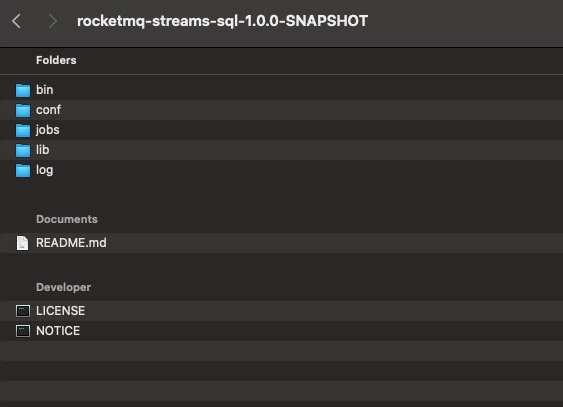
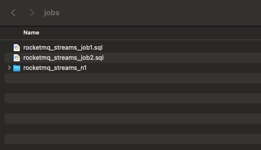
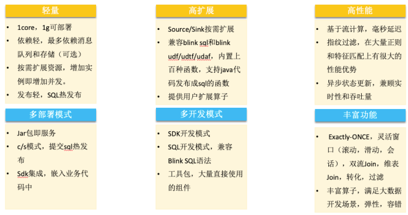

RSQLDB聚焦大数据量->高过滤->轻窗口计算的场景，核心打造轻资源，高性能优势，在资源敏感场景有很大优势，最低1core，1g可部署，做了大量的过滤优化，性能比其他大数据能有2-5倍性能提升。建议的应用场景（安全，风控，边缘计算，消息队列流计算） RocketMQ-Streams兼容Flink/Blink的sql，udf/udtf/udaf，将来我们会和flink生态做深度融合，即可以独立运行，也可以发步成flink任务，跑在flink集群，对于有flink集群的场景，即能享有轻资源优势，可以做到统一部署和运维

# 适配场景



- 计算场景，适合大数据量->高过滤->轻窗口计算的场景。它不同于主流的计算引擎，需要先部署集群，写任务，发布，调优，运行这么复杂的过程，它本身就是一个lib包，基于sdk写完流任务，可以直接运行。支持大数据开发需要的计算特性：exactly-once，灵活窗口（滚动，滑动，会话），双流Join，高吞吐、低延迟、高性能。最低1core，1g可以运行;
- SQL引擎，它也是一个SQL引擎，兼容blink sql语法，支持blink udf/udtf/udaf的扩展。支持sql热升级，写完sql，通过sdk提交sql，就可以完成sql的热发布;
- ETL引擎，它也是一个etl引擎，在很多大数据场景，需要完成数据从一个源经过etl，汇聚到统一存储，里面内置了grok，正则解析等函数，可以结合sql一块完成数据etl;
- 开发SDK，它也是一个数据开发sdk包，里面的大多数组件都可以单独使用，如source/sink，它屏蔽了数据源，数据存储的细节，提供统一的编程接口，一套代码，切换输入输出，不需要改变代码;

# 特点和创新

- **轻资源**

无过多依赖，1core1g可以部署，按需扩展资源，增加实例即可增加并发，同样规则部署，内存资源是flink的1/24。



- **高性能（高过滤场景）**
  - 专门针对过滤做了优化，包括前置过滤指纹，同源规则自动归并，hyperscan加速，表达式指纹等
  - 计算资源比flink降低（65%-95%），专有云部分规则的测试结果。
  - 最好效果，一个超大规则，flink消耗3000 CU，消耗264.25 CU
- **维表 JOIN（千万数据量维表支持）**
  我们为维表 JOIN 做了高压缩的内存设计，无java头部和对齐的开销，内存存储接近原始数据大小，千万维表加载到内存，不超过2G内存，纯内存操作，性能最大化，同时对于Mysql提供了多线程并发加载，提高加载维表的速度。
- **双流 JOIN**
  双流 JOIN 功能是将两条流进行关联，用来补齐流上的字段。双流 JOIN 都是基于窗口实现的，如果不指定窗口，就用默认的窗口时间，默认时间可以通过配置文件修改。
- **TopN**
  TopN 是统计报表和大屏非常常见的功能，主要用来实时计算排行榜。我们提供了分组 TopN 的功能。流上的 TopN 有非常多的挑战。
- **Window**
  支持滚动窗口（Tumble）、滑动窗口（Hop）、会话窗口（Session）以及传统数据库中的OVER窗口，支持exactly-once的能力。

  

# 消息数据结构

- 基于SQL的流计算，更像是在操作一个表，表是二维的，一行数据，更像是一个Map<String,Object>，在RSQLDB中，用JSONObject表示一个流数据，代表表的一行。

- 在数据源中，RSQLDB默认根据encoding这个属性，把字节数组转化成字符串，如果能转化成json，可以根据下面的设置，自动转化成JSONObject:
  - 如果可以转化成JSONObject，可以设置数据源的with属性，isJsonData=true，这个值默认是true，如果是json可以不设置。
  - 如果可以转化成JSONArray，可以设置数据源的with属性，msgIsJsonArray=true
  - create table中的字段名，应该和json的key名字相同。

```sql
create table rocketmq_stream
(
    x varchar,
    y varchar,
    z varchar
) with (
      type = 'rocketmq',
      topic = 'source_topic',
      consumerGroup = 'source_group',
      isJsonData = 'true',
      encoding = 'UTF-8'
      );
```

- 如果不能转化成json，系统会根据createtable的字段名，创建一个 <fieldName,字符串>只有一列的json，如下面的SQL，最终系统会生成{"source_filed":"utf8编码的字符串数据"}

```sql
create table rocketmq_stream
(
    source_filed varchar
) with (
      type = 'rocketmq',
      topic = 'rocketmq_topic',
      consumerGroup = 'rocketmq_group',
      isJsonData = 'false',
      encoding = 'UTF-8'
      );
```

# 数据类型

## 基本类型

| 数据类型 | 可以兼容的类型         |
| --- |---|
| int | Integer         |
| short | Short           |
| byte | Byte            |
| float | Float           |
| double | Double          |
| boolean | Boolean         |
| long | Long，BigInteger |
| String |                 |
| Date | Timestamp       |

## 集合类型

| 数据类型 | 要求 |
| --- | --- |
| List<> | 必须指定范型，且范型类型是上面支持的类型|
| Set<> |  |
| Map<key,value> |  |
| Array |  |

## 类型使用说明

数据源产生的数据，有可能是基于JSONObject.parse完成解析的，里面可能包含各种java类型，可能超出上面支持的类型，不用担心，RSQLDB是可以支持的。原因看下面的序列化部分

# 序列化

RSQLDB的数据只有两种情况会被序列化和反序列化：

- 用到了统计，join等窗口计算，数据需要shuffle，此时需要把数据发送到指定的shuffle消息队列进行转发，此时用到的序列化和反序列化能力是消息队列提供的，RSQLDB并不关注。
- 在窗口计算时，需要保存中间结果，此时需要完成数据的序列化和反序列化，RSQLDB会采用两种方式：
  - 如果是上面支持的类型，RSQLDB自己完成序列化和反序列化
  - 如果有不支持的类型，会用java自带的序列化和反序列化

# 语法介绍

- SQL 输入由一系列语句组成。每个语句都由一系列标记组成，并以分号 “;”结尾。应用的标记取决于被调用的语句。
- 多个语句构成一个拓扑结构，一个SQL中既可以有多个数据源，也可以有多个结果表
- SQL中用‘常量’，表示常量，true/false表示boolean，数字/浮点数字表示数字，其他的表示字段名

```sql
CREATE FUNCTION getCurrentTime as 'com.test.rocketmqtest.function.custom.UDFTest';

CREATE TABLE source_function
(
  `id`           BIGINT,
  `num`          BIGINT,
  `position`     VARCHAR
) WITH (
    type = 'rocketmq',
    topic = 'source_function',
    groupName = 'source_function',
    namesrvAddr = '127.0.0.1:9876',
    isJsonData = 'true',
    msgIsJsonArray = 'false'
    );


CREATE TABLE task_sink
(
  `id`                BIGINT,
  `num`               BIGINT,
  `position`          VARCHAR,
  `function_time`     VARCHAR
) WITH (
    type = 'print'
    );


INSERT INTO task_sink
SELECT
  `id`,
  `num`,
  `position`,
  getCurrentTime()    AS function_time
FROM source_function;
```


