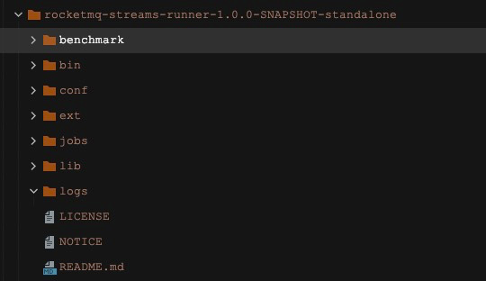

目前rocketmq streams支持单机和集群俩种部署方式，单机部署模式用来快速运行任务，集群部署模式用于大规模数据处理的生产环境； 用户可以根据自己的实际情况来快速选择； 执行部署前，需要先了解一下rocketmq streams的目录结构。

# 下载安装包

[rocketmq-streams.tar.gz]()

# 解压缩

```shell
tar -xvf rocketmq-streams-runner-1.0.0-SNAPSHOT-distribution.tar.gz
```



- `bin` 相关指令，包括start.sh 和 stop.sh
    - start.sh 用于启动任务的脚本， 主要用于启动jobs目录下的任务，
    - stop.sh 用于停止任务的脚本；
    - start-sql.sh 指定脚本文件目录来启动任务；
    - recovery.sh 当中间状态存储为db或者file时， 可以通过recovery.sh 来恢复已经的任务
- `conf` 配置目录，包括mqnamesrv、dipper.properties、log4j.xml等
    - mqnamesrv 内置rocketmq的nameserver的地址，一行一个
    - dipper.properties 用于精细化控制应用执行中的各种参数
    - log4j.xml 用于控制日志的输出等级以及输出方式
- `jobs`  单机模式下存放任务sql脚本的位置
- `lib`  系统默认依赖的包位置
- `ext`  任务依赖的第三方jar包存放的位置
- `log`  任务运行产生的各种日志
- `README.md` 说明文档
- `LICENSE` 许可证
- `NOTICE` 声明


# 参数配置

用户可以通过配置conf/dipper.properties 文件来设定任务运行过程中的各种特征，如指纹设置， state的存储设置等；

```properties

## checkpoint存储配置，可以是memory, DB 或者file， 除了checkpoint外， 任务序列化的内容也会被缓存在该存储
dipper.configurable.service.type=memory
## 当checkpoint为DB时
#dipper.rds.jdbc.type=mysql
#dipper.rds.jdbc.url=jdbc:mysql://host:port/database?serverTimezone=Asia/Shanghai
#dipper.rds.jdbc.username=
#dipper.rds.jdbc.password=
#dipper.rds.jdbc.driver=com.mysql.jdbc.Driver
#dipper.rds.table.name=dipper_configure
## 任务从存储反序列化的频次
#dipper.configurable.polling.time=60
#pipeline.qps.print=true
#homologous.expression.cache.size=100000
#homologous.pre.fingerprint.cache.size=100000
#homologous.optimization.switch=true
## 监控日志的相关配置
# dipper.monitor.output.level=INFO #日志等级，有三种INFO，SLOW，ERROR
#dipper.monitor.slow.timeout=60000
# dipper.monitor.logs.dir=./logs #日志目录
## 窗口配置
# dipper.window.join.default.interval.size.time=  #join的默认窗口大小
# dipper.window.join.default.retain.window.count= #需要保留几个窗口
# dipper.window.default.fire.delay.second=         #窗口延迟多长时间触发
# dipper.window.default.interval.size.time=       #统计默认的窗口大小，单位是分钟。默认是滚动窗口，大小是1个小时
# dipper.window.default.time.unit.adjust=         #统计默认的窗口大小，单位是分钟。默认是滚动窗口，大小是1个小时
# dipper.window.over.default.interval.size.time=  #over partition窗口的默认时间
## 窗口shuffle配置
window.shuffle.channel.type=memory
# window.shuffle.channel.type=rocketmq #shuffle使用的数据存储类型
# window.shuffle.channel.topic=        #根据type的配置，有不同的配置， topic是指用于shuffle的rocketmq的topic；
# window.shuffle.channel.tags=         #根据type的配置，有不同的配置， tags是指用于shuffle的rocketmq的tags；
# window.shuffle.channel.group=        #根据type的配置，有不同的配置， group是指用于shuffle的rocketmq的group；
# window.system.message.channel.owner=#如果能做消息过滤，只过滤本window的消息，可以配置这个属性，如rocketmq的tags.不支持的会做客户端过滤
## 自定义配置文件路径， 默认查找classpath下的配置文件，或者在jar包所在目录的资源文件
# filePathAndName=classpath://dipper.cs
## 把所有的输出重新定向，当测试时，不需要把结果写入正式的输出时，可以使用，默认会打印，如果需要输出到其他存储，可以配置#
# out.mock.switch=false
## mock的类型，可以是print，metaq和sls。下面是具体类型的配置
# out.mock.type=print
# out.mock.metaq.topic=
# out.mock.metaq.tag=
# out.mock.metaq.consumerGroup=
# out.mock.sls.endPoint=
# out.mock.sls.project=
# out.mock.sls.logstore=
# out.mock.sls.accessKey=
# out.mock.sls.accessId=
# out.mock.sls.group=
```

熟悉了上述的内容后， 你可以
+ [单机运行](standalone/README.md)
+ [集群运行](cluster/README.md)