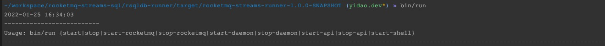

# 快速启动集群模式

## 1. 配置内置rocketmq

修改conf/mqnamesrv 文件，配置rocketmq的name server列表， 每一行一条ip

```shell
10.165.153.60
```

ip需要配置为对外暴露的IP地址，通过 `/sbin/ifconfig | grep inet | grep broadcast | awk '{if($1=="inet") print $2}' | sed 's/addr://g' | tail -1)`
获取

## 2. 配置共享存储

集群模式下，需要设置一个共享的checkpoint存储，来为不同节点的任务提供统一的调度，目前rocketmq支持文件、内存和DB；
修改conf/dipper.properties文件，配置

```properties
## checkpoint存储配置，可以是memory, DB 或者file， 除了checkpoint外， 任务序列化的内容也会被缓存在该存储
dipper.configurable.service.type=DB
## 当checkpoint为DB时
dipper.rds.jdbc.type=mysql
dipper.rds.jdbc.url=jdbc:mysql://host:port/database?serverTimezone=Asia/Shanghai
dipper.rds.jdbc.username=username
dipper.rds.jdbc.password=password
dipper.rds.jdbc.driver=com.mysql.jdbc.Driver
dipper.rds.table.name=tablename #默认为dipper_configure
```

## 3. 启动

启动服务

```shell
bin/run start  #自动启动内置的rocketmq，同时默认启动5个task实例
```

启动的5个task实例进程为真正运行实时任务的进程，
task实例会动态的从3中配置的DB中加载相关任务，来运行；每个task实例运行的实时任务都是相同的任务，来提升任务的并发能力；用户可以通过增加启动参数来改变task的实例数；

```shell
bin/run start 10 #启动10个task实例
```

# 相关脚本详解

## 1. 主入口

```shell
bin/run
```

所有指令都需要通过该入口来执行， 包含了如下指令：


## 2. start-rocketmq

streams默认采用rocketmq来进行shuffle， 可以通过修改dipper.properties中 window.shuffle.channel.type来更改；
当window.shuffle.channel.type=rocketmq时，默认采用系统内置rocketmq，需要启动rocketmq。

```shell
bin/run start-rocketmq #独立启动rocketmq
```

## 3. stop-rocketmq

如果希望关掉默认启动的rocketmq，使用第三方的rocketmq做shuffle做； 用户可以使用

```shell
bin/run stop-rocketmq #停止rocketmq
```

来停止内置的rocketmq， 并且修改dipper.properties如下配置，来使用第三方的rocketmq

```properties
window.shuffle.channel.topic=#topic是指用于shuffle的rocketmq的topic；
window.shuffle.channel.tags=#tags是指用于shuffle的rocketmq的tags；
window.shuffle.channel.group=#group是指用于shuffle的rocketmq的group；
```

## 4. start-daemon

streams框架的守护进程 ，主要用来维护一定数量的streams实例在运行，当streams运行的实例数少于指定数目时，daemon进程会自动补足缺少的实例，
当实例数多余指定数目时，daemon进程会自动kill掉多余的实例；默认情况下维护5个实例运行

```shell
bin/run start-daemon #启动streams守护进程
```

如果希望维持指定数目的streams实例，则可以执行如下指令

```shell
bin/run start-daemon 10  #启动守护进程并维护10个steams实例在运行
```

## 5. stop-daemon

停止守护进程；注意， 停止守护进程不会对streams实例的进程造成影响；但是缺少了对streams实例的维持；

```shell
bin/run stop-daemon #停止守护进程
```

## 6. start-api

启动api进程； 启动api进程后，用户可以通过[http://localhost:7115](http://localhost:7115) 来访问;

```shell
bin/run start-api #启动API进程
```

## 7. stop-api

如果用户不需要api，则可以通过该命令关闭API进程；

```shell
bin/run stop-api
```

## 8. start-shell

为了能够更方便的让用户来操作实时任务，我们也提供了控制台

```shell
bin/run start-shell
```
