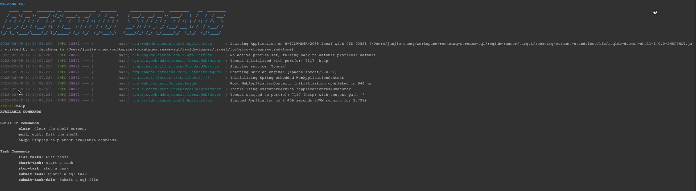
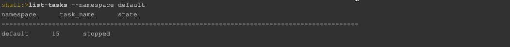
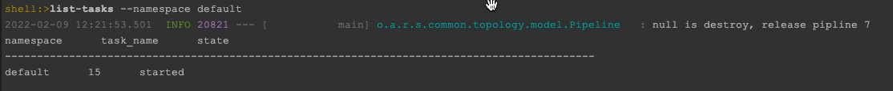
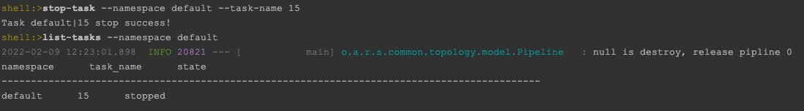
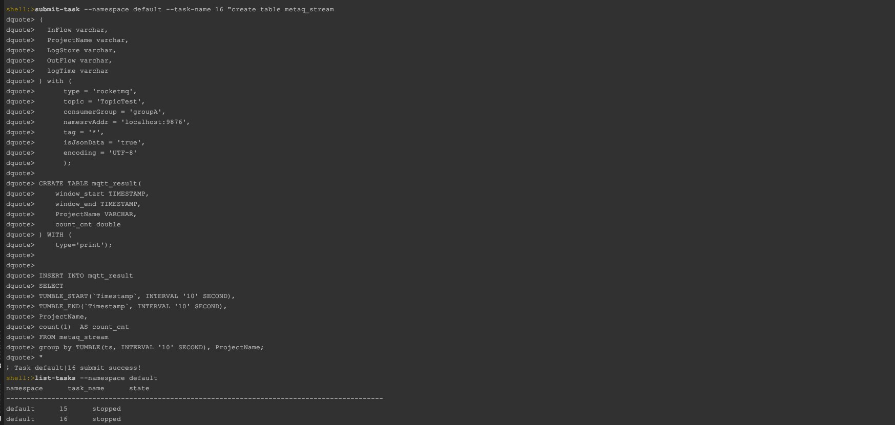

在集群默认下， 用户可以通过http API、shell 控制台 和 SDK三种方式来向集群提交任务，管理任务；

# Http API

我们可以通过http接口来向集群提交任务，管理任务； 在使用http api 之前，我们需要先对集群中启动http api的进程；

## 启动http api功能

登录到某一个工作节点， 进入到 rocketmq-streams 目录

```shell
#!/bin/bash    

#启动API    
bin/run start-api 

```

start-api的默认端口是```7115```， 通过 [http://host:7115](http://host:7115)  即可访问；

## 访问http api

目前API支持实时任务提交、任务启动和任务停止等功能

### 任务列表

#### url

/command/task/list

#### method

POST

#### 参数

namespace：命名空间，默认为```default```

#### 例子

```shell
curl -d 'sql' http://localhost:7115/command/task/list?namespace=
```

### 任务提交

#### url

/command/task/submit

#### method

POST

#### 参数

namespace：命名空间，默认为```default```
taskName：任务名称 requestParam sql: SQL内容 requestBody

#### 例子

```shell
curl -d 'sql' http://localhost:7115/command/task/submit?namespace=&taskName=
```

### 任务提交(基于文件的任务提交)

#### url

/command/task/submit/file

#### method

POST

#### 参数

namespace：命名空间，默认为```default```
taskName：任务名称 requestParam sqlPath: SQL内容 requestBody

#### 例子

```shell
curl -d 'sql' http://localhost:7115/command/task/submit?namespace=&taskName=
```

### 任务启动

#### url

/command/task/start

#### method

POST

#### 参数

namespace：命名空间，默认为```default```
taskName：任务名称 requestParam

#### 例子

```shell
curl http://localhost:7115/command/task/start?namespace=&taskName=
```

### 任务停止

#### url

/command/task/stop

#### method

POST

#### 参数

namespace：命名空间，默认为```default```
taskName：任务名称 requestParam

#### 例子

```shell
curl http://localhost:7115/command/task/stop?namespace=&taskName=
```

# Shell控制台

你可以通过通过shell控制台，来管理整个集群上的任务；

## shell控制台启动

```shell
bin/run start-shell #启动控制台
```



## 使用shell控制台

### 列出namespace下所有的任务

```shell
shell:>list-tasks --namespace default
```



### 启动一个任务

```shell
shell:>start-task --namespace default --task-name 15
```




### 停止一个任务

```shell
shell:>stop-task --namespace default --task-name 15
```



### 提交任务

```shell
shell:>submit-task --namespace default --task-name 16 "create table metaq_stream
dquote> (
dquote>   InFlow varchar,
dquote>   ProjectName varchar,
dquote>   LogStore varchar, 
dquote>   OutFlow varchar, 
dquote>   logTime varchar
dquote> ) with (
dquote>       type = 'rocketmq',
dquote>       topic = 'TopicTest',
dquote>       consumerGroup = 'groupA',
dquote>       namesrvAddr = 'localhost:9876',
dquote>       tag = '*',
dquote>       isJsonData = 'true',
dquote>       encoding = 'UTF-8'
dquote>       );
dquote> 
dquote> CREATE TABLE mqtt_result(
dquote>     window_start TIMESTAMP,
dquote>     window_end TIMESTAMP,
dquote>     ProjectName VARCHAR,
dquote>     count_cnt double
dquote> ) WITH (
dquote>     type='print');
dquote> 
dquote> 
dquote> INSERT INTO mqtt_result
dquote> SELECT 
dquote> TUMBLE_START(`Timestamp`, INTERVAL '10' SECOND),
dquote> TUMBLE_END(`Timestamp`, INTERVAL '10' SECOND),
dquote> ProjectName, 
dquote> count(1)  AS count_cnt 
dquote> FROM metaq_stream
dquote> group by TUMBLE(ts, INTERVAL '10' SECOND), ProjectName;
dquote> "
```



除此之外，还可以通过提交sql文件来实现任务的提交

```shell
shell:>submit-task --namespace default --task-name 17 /home/admin/test_task.sql
```

## 使用SDK

同时你可以通过sdk在自己的应用中向集群提交任务、管理任务；

### maven依赖

```xml

<dependency>
    <groupId>org.apache.rocketmq</groupId>
    <artifactId>rocketmq-client</artifactId>
    <version>1.0.0-SNAPSHOT</version>
</dependency>
```

### 构建RemoteSQLStream实例

```java
 RemoteSqlStream remoteSqlStream=SqlStreamBuilder.remoteSqlStream("default")
    .db()
    .dbConfig("mysql","dipper.properties配置的数据库连接串","数据库用户名","数据库密码")
    .init();
```

RemoteSQLStream实例需要连接到集群指定的调度所用的数据库；

### 获取集群中任务列表

```java
List<StreamsTask> streamsTaskList=remoteSqlStream.list();
    for(StreamsTask streamsTask:streamsTaskList){
    System.out.println(streamsTask.getConfigureName()+"     "+streamsTask.getState());
    }
```

### 启动实时任务

```java
remoteSqlStream.name("任务名称").start();
```

### 停止实时任务

```java
remoteSqlStream.name("任务名称").stop();
```

### 提交任务

```java
remoteSqlStream.name("任务名称").sql("实时任务sql");
```

### 提交任务(sql文件)

```java
remoteSqlStream.name("任务名称").sqlPath("实时任务sql文件的路径");
```
