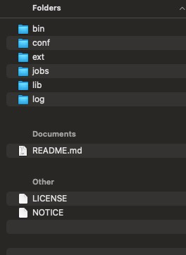
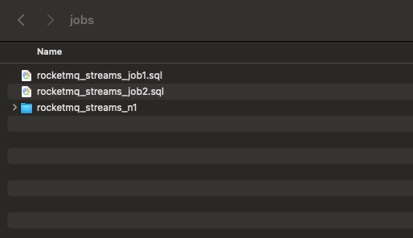

# 快速搭建

## 1. 下载压缩包

[rocketmq-streams-sql-1.0.0-SNAPSHOT-distribution.tar.gz](rocketmq-streams-sql-1.0.0-SNAPSHOT-distribution.tar.gz)

## 2. 将压缩包解压



## 3. 编写任务代码

将任务代码保存为sql文件， 如test.sql 并放入jobs目录

```sql
CREATE FUNCTION json_concat as 'org.apache.rocketmq.streams.udf.JsonConcat';

CREATE TABLE `test_source`
(
    field_1 VARCHAR,
    field_2 VARCHAR,
    field_3 VARCHAR,
    field_4 VARCHAR,
    field_5 VARCHAR,
    field_6 VARCHAR,
    field_7 VARCHAR,
    field_8 VARCHAR,
    field_9 VARCHAR
) WITH (
      type = 'file',
      filePath = '/tmp/test.txt',
      isJsonData = 'true',
      msgIsJsonArray = 'false'
      );


-- 数据标准化

create view view_test as
select field_1
     , field_2
     , field_3
     , field_4
     , field_5
     , field_6
     , field_7
     , field_8
     , field_9
from (
         select field_1 as logtime
              , field_2 as uuid
              , field_3 as proc_name
              , field_4 as cmd
              , field_5 as pproc_name
              , field_6 as pcmd
              , field_7 as pexe
              , field_8 as ppexe
              , cast(field_9) as field9
         from test_source
     ) x
where (
                  lower(field_1) like '%.exe'
              or lower(field_2) like '%.exe'
              or field_3 like '_:/%'
              or field_4 like '_:/%'
              or field_5 like '//%'
              or field_6 like '//%'
          )
;

CREATE TABLE `test_sink`
(
    field_1  VARCHAR,
    field_2  VARCHAR,
    field_3  VARCHAR,
    field_4  VARCHAR,
    field_5  VARCHAR,
    field_6  VARCHAR,
    field_7  VARCHAR,
    field_8  VARCHAR,
    field_9  VARCHAR
) WITH (
      type = 'print'
      );

insert into test_sink
select field_1
     , field_2
     , field_3
     , field_4
     , field_5
     , field_6
     , field_7
     , field_8
     , field_9
from view_test
;

```

## 4. 任务启动

```shell
bin/start.sh 
```

## 5. 查看日志

运行日志会被打印在log/catalina.out文件中

# 详细介绍

## 1. 运行目录介绍


其中

- `bin` 相关指令，包括start.sh 和 stop.sh
    - start.sh 用于启动任务的脚本， 主要用于启动jobs目录下的任务，
    - stop.sh 用于停止任务的脚本；
    - start-sql.sh 指定脚本文件目录来启动任务；
    - recovery.sh 当中间状态存储为db或者file时， 可以通过recovery.sh 来恢复已经的任务
- `conf` 配置目录，包括dipper.properties 以及log4j.xml
    - dipper.properties 用于精细化控制应用执行中的各种参数
    - log4j.xml 用于控制日志的输出等级以及输出方式
- `jobs`  默认的存放任务sql脚本的位置
- `lib`  系统默认依赖的包位置
- `ext`  任务依赖的第三方jar包存放的位置
- `log`  任务运行产生的各种日志
- `README.md` 说明文档
- `LICENSE` 许可证
- `NOTICE` 声明

## 2. 任务开发

sql开发模式与blink基本一样，如果使用过blink会非常好上手，以demo.sql为例说明下sql各结构

```sql
CREATE FUNCTION json_concat as 'org.apache.rocketmq.streams.udf.JsonConcat';

CREATE TABLE `test_source`
(
  field_1 VARCHAR,
  field_2 VARCHAR,
  field_3 VARCHAR,
  field_4 VARCHAR,
  field_5 VARCHAR,
  field_6 VARCHAR,
  field_7 VARCHAR,
  field_8 VARCHAR,
  field_9 VARCHAR
) WITH (
    type = 'file',
    filePath = '/tmp/test.txt',
    isJsonData = 'true',
    msgIsJsonArray = 'false'
    );


-- 数据标准化

create view view_test as
select field_1
     , field_2
     , field_3
     , field_4
     , field_5
     , field_6
     , field_7
     , field_8
     , field_9
from (
       select field_1 as logtime
            , field_2 as uuid
            , field_3 as proc_name
            , field_4 as cmd
            , field_5 as pproc_name
            , field_6 as pcmd
            , field_7 as pexe
            , field_8 as ppexe
            , cast(field_9) as field9
       from test_source
     ) x
where (
            lower(field_1) like '%.exe'
          or lower(field_2) like '%.exe'
          or field_3 like '_:/%'
          or field_4 like '_:/%'
          or field_5 like '//%'
          or field_6 like '//%'
        )
;

CREATE TABLE `test_sink`
(
  field_1  VARCHAR,
  field_2  VARCHAR,
  field_3  VARCHAR,
  field_4  VARCHAR,
  field_5  VARCHAR,
  field_6  VARCHAR,
  field_7  VARCHAR,
  field_8  VARCHAR,
  field_9  VARCHAR
) WITH (
    type = 'print'
    );

insert into test_sink
select field_1
     , field_2
     , field_3
     , field_4
     , field_5
     , field_6
     , field_7
     , field_8
     , field_9
from view_test
```

### create function

```java
CREATE FUNCTION json_concat as 'org.apache.rocketmq.streams.udf.JsonConcat';
```

该部分为udf扩展函数引入部分，函数完成注册后可以可以当做内置函数使用，关于函数扩展的详细使用可以参考这个文档 [https://yuque.antfin.com/rtcompute/doc/sql-udx-readme](https://yuque.antfin.com/rtcompute/doc/sql-udx-readme)
如果要开发新的udf函数，请基于该项目开发 [https://softwaretk.oss-cn-beijing.aliyuncs.com/basement-udf.tar](https://softwaretk.oss-cn-beijing.aliyuncs.com/basement-udf.tar)，打包后将jar包放入ext目录下即可

### create table

创建数据源表，主要属性为数据源字段列表，字段名称与数据源相匹配即可，另外一部分为数据源属性 以sls为例：

```java
    type='sls',  //数据源类型 此处为sls
    endPoint='',  //sls endpoint地址
    project='', //sls project name
    logStore='', // sls logstore
    accessId='', // 访问sls的accesskey，如果使用阿里云公网 登陆网站可以查询
    accessKey='' // 访问sls的secretKey，如果使用阿里云公网 登陆网站可以查询
```

### create view

维表语法与create table类似，由于维表是数据处理过程的中间表，因此维表没有自己独立的数据源，维表数据均来自数据源表或者维表。

### insert into

将最终的结果数据写入指定数据源

## 3. 自定义函数开发

udf（user define function）作为数据处理过程中的额外的补充能力，可以方便的为引入开发者自己个性化的处理逻辑，既利用该特性补充增强内置函数的处理能力，同时也可以复用开发者已有的逻辑实现，降低开发成本。 ​

目前rocketmq-stream支持的udf开发方法共有三种：

### 基于blink udf工具包

rocketmq-streams计算框架全面兼容blink的udf， 既可以直接使用blink的udf 包， 也完全支持基于blink规范开发的自定义UDF，blink udf 的使用和定义可以参考文[https://help.aliyun.com/document_detail/69462.html](https://help.aliyun.com/document_detail/69462.html)。

### 基于rocketmq-stream-script开发

首先需要引入依赖

```xml

<dependency>
    <groupId>org.apache.rocketmq</groupId>
    <artifactId>rocketmq-streams-script</artifactId>
</dependency>
```

实现的udf类需要添加@Function注解以便让rocketmq-stream在进行udf加载时识别扫面，同时在具体方法上添加 @FunctionMethod注解，以表示该方法需要注册为udf。@FunctionMethod 需要配置value属性选配alias属性，value为函数的名称，alias为函数别名，在开发sql过程中引用udf函数名称须严格与这两个配置函数名保持一致。 代码开发示例：

```java
package com;

import org.apache.rocketmq.streams.common.context.IMessage;
import org.apache.rocketmq.streams.script.annotation.Function;
import org.apache.rocketmq.streams.script.annotation.FunctionMethod;
import org.apache.rocketmq.streams.script.context.FunctionContext;

@Function
public class ContentExtract {
    @FunctionMethod(value = "extractTest", alias = "extract_test")
    public Object extracttest(IMessage message, FunctionContext context, String config) {
        System.out.println("ContentExtract ========================" + config);

        return "";
    }

}
```

SQL使用实例

```sql
//extract_test为代码中标记@FunctionMethod的value或者alias值，类为实际类名
CREATE FUNCTION extract_test as 'com.ContentExtract';
```

### 用户已有的函数

需要将注册函数所在类以及依赖的全部jar打包为一个jar，在SQL引用上 函数名称应为实际函数名，类名为实际类名。

上述三种方式，都会生成运行时的jar包， 只需要将jar包放入实时框架的ext目录即可， 实时任务在启动时会自动加载； ​

## 4. 任务发布

默认情况下任务发布在jobs目录下， 以`.sql`文件的形式存在, 每一个独立的sql文件就是一个实时任务



jobs目录最多俩层，如果sql文件直接放在jobs目录下， 则该文件的名称就是任务的namespace以及任务的名称； jobs目录可以有第二层目录， sql文件也可以放在这一层目录中，此时文件夹的名称就是namespace的名称，而文件夹中目录的名称为任务的名称；

## 5. 任务的运行和停止

任务可以通过bin目录中的start.sh 和stop.sh对任务进行启动和停止；

### 任务启动

框架的jobs目录是默认的任务脚本存放的目录， 用户可以通过`start.sh` 脚本来启动该目录下的任务

```shell
#启动过程中不加任务参数，则会将jobs中所有的任务都同时启动
bin/start.sh

#启动过程加入第一个参数，即namespace参数， 则会将jobs目录下， namespace子目录下的任务都同时启动
bin/start.sh namespace

# 启动过程中如果添加了namespace 和 任务名称， 则系统会在jobs目录中查询相关同名任务并启动，即便是
# 存在于不同的namespace的同名任务
bin/start.sh namespace job_name

# 用户可以给每个任务去配置不同的jvm 参数
bin/start.sh namespace job_name  '-Xms2048m -Xmx2048m -Xss512k'
```

同时，rocketmq-streams框架还支持指定脚本目录，来启动实时任务

```shell
#指定sql脚本的文件路径，启动实时任务， 此时任务的namespace和任务名称都与文件名相同
bin/start-sql.sh sql_file_path

#除了指定sql脚本的文件路径，还指定了namespace， 此时任务使用指定的namespace来启动
bin/start-sql.sh sql_file_path namespace

# 启动过程中如果添加了namespace和任务名称，则任务使用指定的namespace和job_name来启动
bin/start.sh sql_file_path namespace job_name

# 用户可以给每个任务去配置不同的jvm 参数
bin/start.sh sql_file_path namespace job_name  '-Xms2048m -Xmx2048m -Xss512k'
```

### 任务停止

```shell
# 停止过程不加任何参数，则会将目前所有运行的任务同时停止
bin/stop.sh

# 停止过程添加了任务名称， 则会将目前运行的所有同名的任务都全部停止
bin/stop.sh job_name
```

### 任务恢复

基于sql脚本编译后的中间结果对任务进行恢复， 中间结果存储的类型以及相关的配置有dipper.properties中的相关项来设置，当存储类型为memory时，任务是无法恢复的

```shell
# 恢复具体的某个job
bin/recover.sh namespace jobname

# 恢复某个namespace下所有的job
bin/recover.sh namespace

```

## 6 任务运行时配置

用户可以通过配置dipper.properties 文件来设定任务运行过程中的各种特征，如指纹设置， state的存储设置等；

```properties
## 任务编译中间结果存储配置，可以是memory, DB 或者file， 该存储除了被用来存放编译后的中间结果外，还会被用来存放checkpoint的值、有状态计算的中间结果等信息
dipper.configurable.service.type=memory
## 当type为DB时
# dipper.rds.jdbc.type=
# dipper.rds.jdbc.url=
# dipper.rds.jdbc.username=
# dipper.rds.jdbc.password=
# dipper.rds.jdbc.driver=com.mysql.jdbc.Driver
# dipper.rds.table.name=dipper_configure
## 任务从存储反序列化的频次
# dipper.configurable.polling.time=60   #单位秒(s)
## 监控日志的相关配置
# dipper.monitor.output.level=INFO #日志等级，有三种INFO，SLOW，ERROR
# dipper.monitor.slow.timeout=60000 #慢查询超时时间
# dipper.monitor.logs.dir=./logs #日志目录
## 窗口配置
# dipper.window.join.default.interval.size.time=  #join的默认窗口大小
# dipper.window.join.default.retain.window.count= #需要保留几个窗口
# dipper.window.default.fire.delay.second=         #窗口延迟多长时间触发
# dipper.window.default.interval.size.time=       #统计默认的窗口大小，单位是分钟。默认是滚动窗口，大小是1个小时
# dipper.window.default.time.unit.adjust=         #统计默认的窗口大小，单位是分钟。默认是滚动窗口，大小是1个小时
# dipper.window.over.default.interval.size.time=  #over partition窗口的默认时间
## 窗口shuffle配置
# window.shuffle.channel.type=rocketmq #shuffle使用的数据存储类型
# window.shuffle.channel.topic=        #根据type的配置，有不同的配置， topic是指用于shuffle的rocketmq的topic；
# window.shuffle.channel.tags=         #根据type的配置，有不同的配置， tags是指用于shuffle的rocketmq的tags；
# window.shuffle.channel.group=        #根据type的配置，有不同的配置， group是指用于shuffle的rocketmq的group；
# window.system.message.channel.owner=#如果能做消息过滤，只过滤本window的消息，可以配置这个属性，如rocketmq的tags.不支持的会做客户端过滤
## 自定义配置文件路径， 默认查找classpath下的配置文件，或者在jar包所在目录的资源文件
# filePathAndName=classpath://dipper.cs
## 把所有的输出重新定向，当测试时，不需要把结果写入正式的输出时，可以使用，默认会打印，如果需要输出到其他存储，可以配置#
# out.mock.switch=false
## mock的类型，可以是print，metaq和sls。下面是具体类型的配置
# out.mock.type=print
# out.mock.metaq.topic=
# out.mock.metaq.tag=
# out.mock.metaq.consumerGroup=
# out.mock.sls.endPoint=
# out.mock.sls.project=
# out.mock.sls.logstore=
# out.mock.sls.accessKey=
# out.mock.sls.accessId=
# out.mock.sls.group=
```

​

