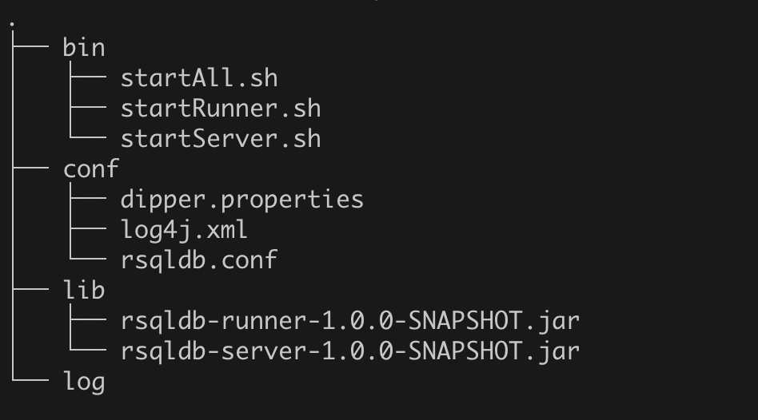

# 快速搭建

## 构建
```xml
mvn clean package -Dmaven.test.skip=true
```
在rsqldb-disk下找到rsqldb-distribution.tar.gz

## 将压缩包解压
tar -xvf rsqldb-distribution.tar.gz 得到如下文件结构



## 参数配置

熟悉了上述的内容后， 你可以
+ [单机运行](standalone/README.md)
+ [集群运行](cluster/README.md)

## 编写任务代码

