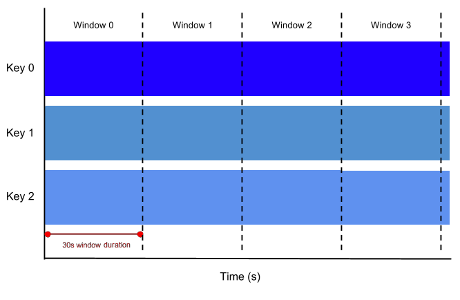
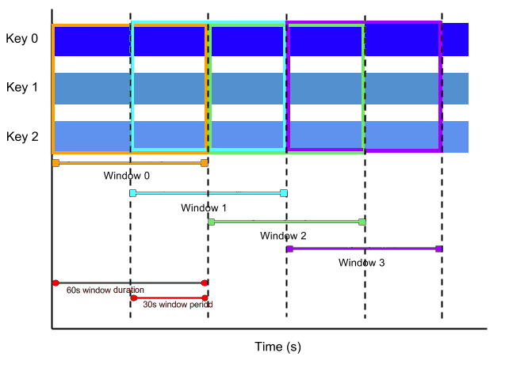
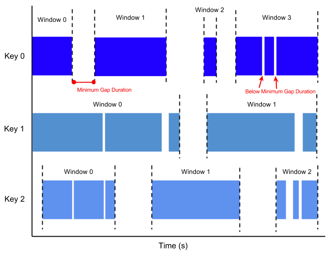

Group Window 是定义在 SQL 查询的 GROUP BY 子句中。就像标准的 GROUP BY 语法一样，带有窗口函数的GROUP BY查询，其结果也是每个分组计算出一条结果。窗口函数出现在 GROUP BY 子句中，定义了一个 key 值（代表一个 window 包含了多行）。

# 一、滚动窗口（TUMBLE）

滚动窗口将每个元素分配到一个指定窗口大小的窗口中，滚动窗口有一个固定的大小，并且不会出现重叠。例如：如果指定了一个5分钟大小的滚动窗口，那么无限流的数据会根据时间划分成[0:00 - 0:05), [0:05, 0:10), [0:10, 0:15)... 等窗口。如下图展示了一个 30秒大小的滚动窗口划分。



#### 窗口函数语法:

用在 GROUP BY 子句中，定义 window。

```sql
TUMBLE
(<time-attr>, <size-interval>)

<size-interval>: INTERVAL 'string' timeUnit
```

> 参数必须是流中的一个合法的时间属性字段，即指定了 processing time 或是 event time。

#### 窗口标识函数：

使用标识函数选出窗口的起始时间或者结束时间，或者窗口的时间属性用于下级 window 的聚合。

| 窗口标识函数 | 返回类型 | 描述 |
| --- | --- | --- |
| TUMBLE_START(`<time-attr>`

, `<size-interval>`
) | Timestamp | 返回窗口的起始时间（包含边界）。如[00:10, 00:15) 的窗口，返回 00:10 。 | | TUMBLE_END(`<time-attr>`
, `<size-interval>`
) | Timestamp | 返回窗口的结束时间（包含边界）。如[00:00, 00:15) 的窗口，返回 00:15。 | | TUMBLE_ROWTIME(`<time-attr>`
, ```) | Timestamp(rowtime-attr) | 返回窗口的结束时间（不包含边界）。如 [00:00, 00:15) 的窗口，返回 00:14:59.999 。 返回值是一个 rowtime attribute，也就是可以基于该字段做时间类型的操作，如级联窗口。 只能用在基于 event time 的 window 上。 | | TUMBLE_PROCTIME(`<time-attr>`
, `<size-interval>`
) | Timestamp(rowtime-attr) | 返回窗口的结束时间（不包含边界）。如 [00:00, 00:15) 的窗口，返回 00:14:59.999 。 返回值是一个 proctime attribute，也就是可以基于该字段做时间类型的操作，如级联窗口。只能用在基于 processing time 的 window 上。注意：TUMBLE_PROCTIME只在需要时物化，所以直接输出时物化时间会晚于窗口边界，如果有需要输出TUMBLE_PROCTIME情况，可以输出TUMBLE_END |

**案例：**

统计每个用户每分钟的点击次数。

```sql
CREATE TABLE window_input
(
    username  varchar,
    click_url varchar,
    ts        timeStamp,
    WATERMARK wk FOR ts as withOffset(ts, 2000) -- 为 rowtime 定义watermark
) with (
      type = 'file',
      ...
      );

CREATE TABLE tumble_output
(
    window_start TIMESTAMP,
    window_end   TIMESTAMP,
    username     VARCHAR,
    clicks       BIGINT
) with (
      type = 'print'
      );

INSERT INTO tumble_output
SELECT TUMBLE_START(ts, INTERVAL '1' MINUTE),
       TUMBLE_END(ts, INTERVAL '1' MINUTE),
       username,
       COUNT(click_url)
FROM window_input
GROUP BY TUMBLE(ts, INTERVAL '1' MINUTE), username
```

# 二、滑动窗口（HOP）

滑动窗口，也被称作 Sliding Window。不同于滚动窗口的窗口不重叠，滑动窗口的窗口可以重叠。滑动窗口有两个参数：size 和 slide。size 为窗口的大小，slide 为每次滑动的步长。如果slide < size，则窗口会重叠，每个元素会被分配到多个窗口；如果 slide = size，则等同于TUMBLE。如果 slide > size，则为跳跃窗口，窗口之间没有重叠且有间隙。

因为多个窗口是重叠的，大部分元素属于多个窗口。这种窗口在计算移动平均数（moving averages）是很实用的。例如，计算过去5分钟数据的平均值，每10秒钟更新一次，那么 size=5分钟，slide=10秒钟。如下图所示展示一个1分钟窗口大小，每30秒滑动一次的滑动窗口。



#### 窗口函数语法:

用在 GROUP BY 子句中，定义 window。

```sql
HOP
(<time-attr>, <slide-interval>, <size-interval>)

<slide-interval>: INTERVAL 'string' timeUnit
<size-interval>: INTERVAL 'string' timeUnit
```

参数必须是流中的一个合法的时间属性字段，即指定了 processing time 或是 event time。

#### 窗口标识函数：

使用标识函数选出窗口的起始时间或者结束时间，或者窗口的时间属性用于下级 window 的聚合。

| 窗口标识函数 | 返回类型 | 描述 |
| --- | --- | --- |
| HOP_START(<`time-attr`

> , <`slide-interval`
> , <`size-interval`
> ) | Timestamp | 返回窗口的起始时间（包含边界）。如[00:10, 00:15) 的窗口，返回 00:10 。 | | HOP_END(<`time-attr`
> , <`slide-interval`
> , <`size-interval`
> ) | Timestamp | 返回窗口的结束时间（包含边界）。如[00:00, 00:15) 的窗口，返回 00:15。 |

#### 案例：

统计每个用户过去1分钟的点击次数，每30秒更新一次。也就是一分钟的窗口，30秒滑动一次。

```sql
CREATE TABLE window_input
(
    username  varchar,
    click_url varchar,
    ts        timeStamp,
    WATERMARK wk FOR ts as withOffset(ts, 2000) -- 为 rowtime 定义watermark
) with (
      type = 'datahub',
      ...
      );

CREATE TABLE tumble_output
(
    window_start TIMESTAMP,
    window_end   TIMESTAMP,
    username     VARCHAR,
    clicks       BIGINT
) with (
      type = 'print'
      );

INSERT INTO tumble_output
SELECT HOP_START(ts, INTERVAL '30' SECOND, INTERVAL '1' MINUTE),
       HOP_END(ts, INTERVAL '30' SECOND, INTERVAL '1' MINUTE),
       username,
       COUNT(click_url)
FROM window_input
GROUP BY HOP(ts, INTERVAL '30' SECOND, INTERVAL '1' MINUTE), username
```

# 三、会话窗口（SESSION）

会话窗口通过session活动来对元素进行分组，会话窗口跟滚动窗口和滑动窗口相比，没有窗口重叠，没有固定窗口大小。相反，当它在一个固定的时间周期内不再收到元素，即会话断开，那这个窗口就会关闭。一个会话窗口通过一个间隔时间（gap）来配置，这个间隔定义了非活跃周期的长度。例如，一个表示鼠标点击活动的数据流可能具有长时间的空闲时间，并在其间散布着高浓度的点击。 如果数据在最短指定的间隔持续时间之后到达，则会开始一个新的窗口。如下图所示，展示了会话窗口，注意每个 key 由于不同的数据分布有不同的 window。



窗口函数语法:

用在 GROUP BY 子句中，定义 window。

```sql
SESSION(<time-attr>, <gap-interval>)

<gap-interval>: INTERVAL 'string' timeUnit
```

参数必须是流中的一个合法的时间属性字段，即指定了 processing time 或是 event time

#### 窗口标识函数：

使用标识函数选出窗口的起始时间或者结束时间，或者窗口的时间属性用于下级 window 的聚合。

| 窗口标识函数 | 返回类型 | 描述 |
| --- | --- | --- |
| SESSION_START(<`time-attr`

> , <`gap-interval`
> ) | Timestamp | 返回窗口的起始时间（包含边界）。如[00:10, 00:15) 的窗口，返回 00:10 。 | | SESSION_END(<`time-attr`
> , <`gap-interval`
> ) | Timestamp | 返回窗口的结束时间（包含边界）。如[00:00, 00:15) 的窗口，返回 00:15。 |

#### 案例：

统计每个用户在每个活跃会话期间的点击次数，会话超时时间30秒。

```sql
CREATE TABLE window_input
(
    username  varchar,
    click_url varchar,
    ts        timeStamp,
    WATERMARK wk FOR ts as withOffset(ts, 2000) -- 为 rowtime 定义watermark
) with (
      type = 'datahub',
      ...
      );

CREATE TABLE tumble_output
(
    window_start TIMESTAMP,
    window_end   TIMESTAMP,
    username     VARCHAR,
    clicks       BIGINT
) with (
      type = 'print'
      );

INSERT INTO tumble_output
SELECT SESSION_START(ts, INTERVAL '30' SECOND),
       SESSION_END(ts, INTERVAL '30' SECOND),
       username,
       COUNT(click_url)
FROM window_input
GROUP BY SESSION (ts, INTERVAL '30' SECOND), username
```

# 四、级联窗口

Dipper实现和blink略有不同，不需要使用 TUMBLE_ROWTIME、HOP_ROWTIME、SESSION_ROWTIME 辅助函数来获取event_time值，直接级联就行。

```sql
CREATE TABLE user_clicks
(
    username  varchar,
    click_url varchar,
    ts        timeStamp,
    WATERMARK wk FOR ts as withOffset(ts, 2000) -- 为 rowtime 定义watermark
) with (
      type = 'datahub',
      ...
      );

CREATE TABLE tumble_output
(
    window_start TIMESTAMP,
    window_end   TIMESTAMP,
    username     VARCHAR,
    clicks       BIGINT
) with (
      type = 'print'
      );

CREATE VIEW one_minute_window_output as
SELECT
        // 不需要使用 TUMBLE_ROWTIME 作为二级 window 的聚合时间
        username,
        COUNT (click_url) as cnt
        FROM window_input
        GROUP BY TUMBLE(ts, INTERVAL '1' MINUTE), username;

INSERT INTO tumble_output
SELECT TUMBLE_START(rowtime, INTERVAL '1' HOUR),
       TUMBLE_END(rowtime, INTERVAL '1' HOUR),
       username,
       SUM(cnt)
FROM one_minute_window_output
GROUP BY TUMBLE(rowtime, INTERVAL '1' HOUR), username
```
